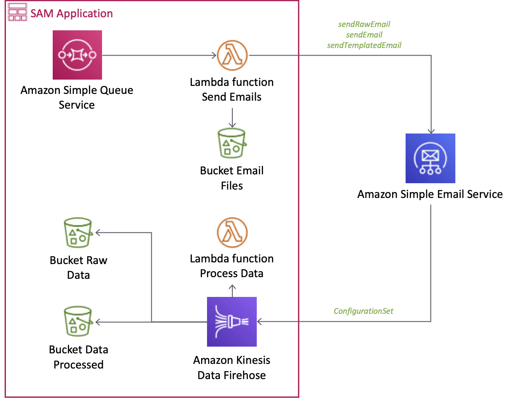

# Sending emails using Amazon SES

This project contains source code and supporting files for a serverless application that you can deploy with the SAM CLI.



## Requirements

- Work inside your AWS Cloud9 or local environment - [Create an EC2 Environment](https://docs.aws.amazon.com/cloud9/latest/user-guide/create-environment-main.html#create-environment-console)
- Verify at least 2 emails (sender & destination) - [Verifying an email address using the Amazon SES console](https://docs.aws.amazon.com/ses/latest/DeveloperGuide/verify-email-addresses-procedure.html)

## Deploy the application

The Serverless Application Model Command Line Interface (SAM CLI) is an extension of the AWS CLI that adds functionality for building and testing Lambda applications. It uses Docker to run your functions in an Amazon Linux environment that matches Lambda. It can also emulate your application's build environment and API.

To use the SAM CLI, you need the following tools.

* SAM CLI - [Install the SAM CLI](https://docs.aws.amazon.com/serverless-application-model/latest/developerguide/serverless-sam-cli-install.html)
* [Python 3 installed](https://www.python.org/downloads/)
* Docker - [Install Docker community edition](https://hub.docker.com/search/?type=edition&offering=community)

To build and deploy your application for the first time, run the following in your shell:

```bash
sam build
sam deploy --guided
```

The first command will build the source of your application. The second command will package and deploy your application to AWS, with a series of prompts:

* **Stack Name**: The name of the stack to deploy to CloudFormation. This should be unique to your account and region, and a good starting point would be something matching your project name.
* **AWS Region**: The AWS region you want to deploy your app to.
* **Confirm changes before deploy**: If set to yes, any change sets will be shown to you before execution for manual review. If set to no, the AWS SAM CLI will automatically deploy application changes.
* **Allow SAM CLI IAM role creation**: Many AWS SAM templates, including this example, create AWS IAM roles required for the AWS Lambda function(s) included to access AWS services. By default, these are scoped down to minimum required permissions. To deploy an AWS CloudFormation stack which creates or modified IAM roles, the `CAPABILITY_IAM` value for `capabilities` must be provided. If permission isn't provided through this prompt, to deploy this example you must explicitly pass `--capabilities CAPABILITY_IAM` to the `sam deploy` command.
* **Save arguments to samconfig.toml**: If set to yes, your choices will be saved to a configuration file inside the project, so that in the future you can just re-run `sam deploy` without parameters to deploy changes to your application.

You can find your **Amazon S3 bucket name** and **URL for Amazon SQS** in the output values displayed after deployment.

## Add a resource to your application

The application template uses AWS Serverless Application Model (AWS SAM) to define application resources. AWS SAM is an extension of AWS CloudFormation with a simpler syntax for configuring common serverless application resources such as functions, triggers, and APIs. For resources not included in [the SAM specification](https://github.com/awslabs/serverless-application-model/blob/master/versions/2016-10-31.md), you can use standard [AWS CloudFormation](https://docs.aws.amazon.com/AWSCloudFormation/latest/UserGuide/aws-template-resource-type-ref.html) resource types.

If you add or modify the project, deploy the SAM application with parameter overrides.

```bash
sam deploy --parameter-overrides ParameterKey=SenderEmail,ParameterValue=sender_email@domain.com
```

## Create a Configuration Set for Amazon SES

Before continue, we need to create a configuration set that defines a group of rules to the emails sent using Amazon SES.
Amazon SES can track the number of send, delivery, open, click, bounce, and complaint events for each email you send.

We are going to publish email sending events to an Amazon Kinesis Data Firehose delivery stream to be processed and stored.

## Test sending email with Amazon SES

Upload file to Amazon S3 used for sending emails as URL & attachment.

```bash
aws s3 cp ses-test/tokyo-skytree.pdf s3://<bucket_name>/files/tokyo-skytree.pdf
```

Create environment variables for testing, including the configuration set name created before.

```bash
cd ses-test
export SENDER_EMAIL='sender_email@domain.com'
export DESTINATION_EMAIL='destination_email@domain.com'
export DESTINATION_NAME='destination name'
export BUCKET_NAME='bucket_name'
export CONFIGURATION_SET_NAME='configuration_set_name'
```

Install the latest Boto 3 release via pip.

```bash
python -m pip install --user boto3
```

Create a base template to send emails

```bash
python create_template.py
aws ses list-templates
```

Send emails using the template.

```bash
python send_templated_email.py
```

Send email from HTML file.

```bash
python send_email.py
```

Send raw email from HTML file with attachment.

```bash
python send_raw_email.py
```

[More examples for send raw emails.](https://docs.aws.amazon.com/ses/latest/DeveloperGuide/examples-send-raw-using-sdk.html)

## Test the SAM project sending messages to the queue

Edit the **ses-test/send-message.json** file to send to the queue.

Send a message to the queue to be processed by the lambda function.

```bash
aws sqs send-message --queue-url <queue_url> --message-body "Send email." --delay-seconds 10 --message-attributes file://send-message.json
```

## Fetch, tail, and filter Lambda function logs

To simplify troubleshooting, SAM CLI has a command called `sam logs`. `sam logs` lets you fetch logs generated by your deployed Lambda function from the command line. In addition to printing the logs on the terminal, this command has several nifty features to help you quickly find the bug.

`NOTE`: This command works for all AWS Lambda functions; not just the ones you deploy using SAM.

```bash
sam logs -n SendEmailsFunction --stack-name sam-send-emails --tail
sam logs -n ProcessDataFunction --stack-name sam-send-emails --tail
```

You can find more information and examples about filtering Lambda function logs in the [SAM CLI Documentation](https://docs.aws.amazon.com/serverless-application-model/latest/developerguide/serverless-sam-cli-logging.html).


## Cleanup SAM Project

To delete the sample application that you created, use the AWS CLI. Assuming you used your project name for the stack name, you can run the following:

```bash
aws cloudformation delete-stack --stack-name sam-send-emails
```

## Resources

See the [AWS SAM developer guide](https://docs.aws.amazon.com/serverless-application-model/latest/developerguide/what-is-sam.html) for an introduction to SAM specification, the SAM CLI, and serverless application concepts.

Next, you can use AWS Serverless Application Repository to deploy ready to use Apps that go beyond hello world samples and learn how authors developed their applications: [AWS Serverless Application Repository main page](https://aws.amazon.com/serverless/serverlessrepo/)
